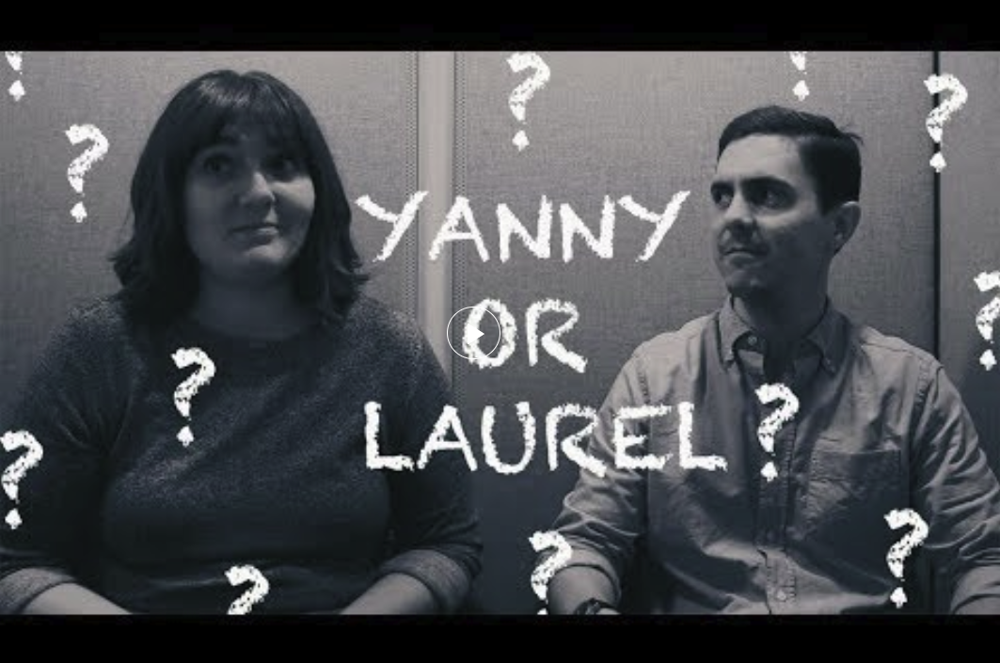

# About me
I am a Research Assistant Professor at Northwestern University in the Department of Communication Sciences and Disorders, where I study the brain regions and connections that underlie human perception and communication in the [SoundBrain Lab](https://www.shrs.pitt.edu/csd/research/sound-brain-lab/sound-brain-lab-members). 

Until recently I was involved in the Organization for Human Brain Mapping community as [Communications Committee](https://www.ohbmbrainmappingblog.com) Chair-elect/Chair/Past Chair (2022–25). Prior to that I served on the Student–Postdoc Special Interest Group (2019–2021), Virtual Integration Task Force (2021–2022), and the Communications Committee Podcast Team (2021–2022).

I received my PhD in 2019 from Harvard University's [Program in Speech and Hearing Bioscience and Technology](http://dms.hms.harvard.edu/shbt/), where I was mentored by [Dr. Satra Ghosh](http://satra.cogitatum.org/) at the [McGovern Institute for Brain Research](https://mcgovern.mit.edu/) at MIT.

While I was at MIT, a small audio clip took the world by storm. With another PhD student, Dana Boebinger, I gave my perspective on the auditory phenomenon of "Yanny" vs. "Laurel", which has been viewed over 50,000 times [on youtube](https://youtu.be/zaAdNbOTSWY).

I also worked with [Science in the News](http://sitn.hms.harvard.edu/), a graduate student-run organization that communicates impactful science to general audiences. This included editing a blog series on [neuroscience and technology](http://sitn.hms.harvard.edu/special-edition-neurotechnology/) and running the group's [twitter account](https://www.twitter.com/SITNBoston).

I got my Bachelor's degree in Linguistics and Cognitive Science at the University of California, Berkeley (Go Bears!) in 2011. I got my first taste of research in the Berkeley Phonology Lab working with Dr. Keith Johnson and (then) PhD students Sam Tilsen and Charles Chang. My undergrad honors thesis used artificially separated speech sounds to investigate phonetic processing in first few milliseconds after hearing the sounds. Outside of the lab, I was an organizer of the Berkeley Project community volunteer organization and an avid consumer of burritos.

Between undergrad and grad school, I was a staff research assistant at the San Francisco VA Medical Center in the Brain Imaging and EEG Laboratory. This was an amazing experience that allowed me to incorporate my phonetics background with brain imaging methods used to investigate psychiatric disorders.
