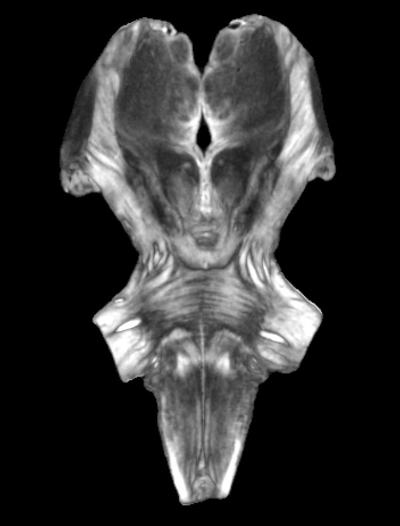

## Imaging the human subcortical auditory system
I'm a neuroscientist studying subcortical structures in the human brain that process sensory stimuli.
I am currently a research assistant professor at Northwestern University in the [Roxelyn and Richard Pepper Department of Communication Sciences and Disorders ](https://communication.northwestern.edu/academics/communication-sciences-and-disorders/). I was previously a research scientist at the [Sound Brain Lab](https://www.shrs.pitt.edu/csd/research/sound-brain-lab) at the University of Pittsburgh.
I'm funded by an NIH K01 Mentored Career Development award (1K01DC019421-01A1) entitled "Investigating human non-lemniscal inferior colliculus contributions to auditory learning with 7T MRI" (2022–2027).

You can find me on [mastodon](https://fediscience.org/@sitek), [twitter](https://twitter.com/krsitek), [GitHub](https://github.com/sitek), and [ResearchGate](https://www.researchgate.net/profile/Kevin_Sitek).

I'm also a member of the Organization for Human Brain Mapping Communication Committee, producing the [OHBM Neurosalience podcast](https://anchor.fm/ohbm), contributing to [OHBM blog posts](https://www.ohbmbrainmappingblog.com/contributors.html) and serving as Chair-elect in 2022–23.

Connections between the human subcortical auditory structures, as estimated by diffusion-weighted MRI tractography of a post mortem sample.

A terrifying creature lurking in a T2*-weighted anatomical MRI of the same post mortem sample....
