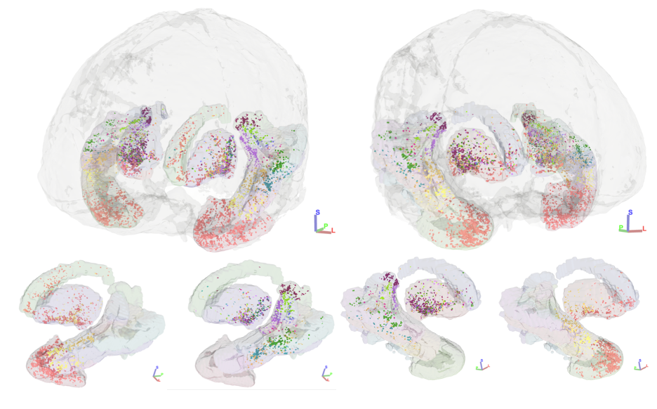
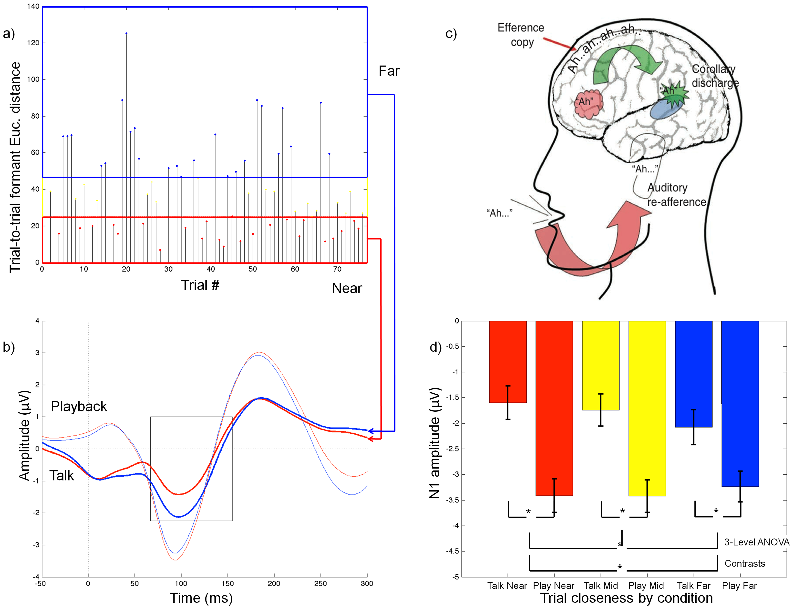
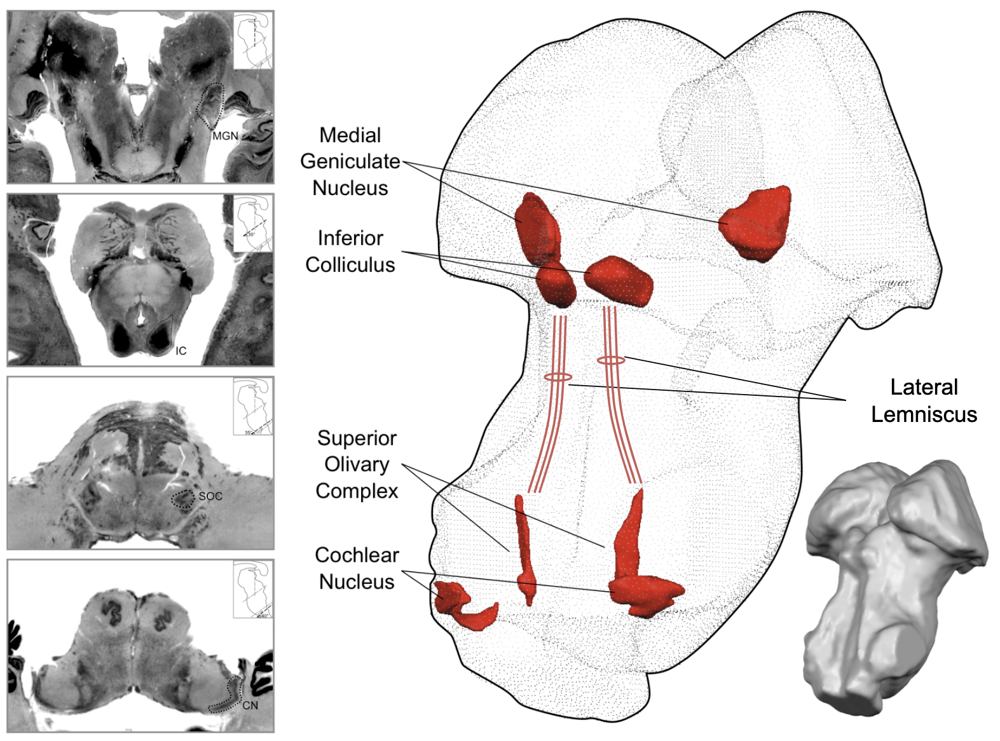

# Research interests
My research uses state-of-the-art neuroimaging techniques including functional MRI, diffusion-weighted MRI tractography, and electroencephalography (EEG) to investigate the neural systems that support human communication, with a particular focus on the auditory system and speech processing. 

I have a strong interest in [subcortical auditory structures](#mapping-the-human-subcortical-auditory-system), which are understudied in humans due to technical challenges. I use ultra-high field MRI (7T and above) and post mortem imaging to overcome these challenges and to bridge the gap between animal models and human neuroimaging.

My current research program has three primary aims: 

1. Characterize the role of human subcortical auditory nuclei such as inferior colliculus in [auditory learning and decision-making](#auditory-learning-and-decision-making) (funded by an NIH K01 Mentored Career Development Award)
2. Assay fine-grained [cortical and subcortical auditory contributions to speech–motor control](#cortical-and-subcortical-contributions-to-speechmotor-control) (funded by an NIH Early Career Researcher R21 Award)
3. Examine the neural systems underlying [speech and hearing across the normal lifespan and in disordered populations]()

## Auditory learning and decision-making

### Corticostriatal pathways enabling auditory decision-making and speech category learning
Auditory decision making critically depends upon structural connections between superior temporal cortex and dorsal striatum. Auditory corticostriatal connections have been mapped in animal models including non-human primates, where primary auditory cortex preferentially connects to putamen while caudate head receives most of its inputs from anterior superior temporal cortex. Using a publicly available high-quality, high-resolution human diffusion-weighted MRI dataset, we identified structural connectivity streamlines between auditory cortical regions and dorsal striatal regions that suggest a privileged route from speech-related auditory cortex to posterior putamen ([Sitek, Helou, and Chandrasekaran, 2022 preprint](https://doi.org/10.1101/2022.08.04.502679)).

### Auditory category representations across the brain
Dorsal striatum has a clear role for auditory behavior in animal models, but its involvement in human communication is poorly understood. Using ultra-high field 7T MRI, we acquired 1.5 mm isotropic resolution BOLD functional MRI from participants who categorized Mandarin speech stimuli on the basis of dynamically varying pitch patterns. With univariate and representational similarity analysis, we find that dorsal striatum and auditory cortex are both involved in auditory category learning during the earliest learning stages (Sitek et al., in revision). Overall, our work demonstrates prioritized connectivity between superior temporal cortex and striatum and is highly suggestive of distinct functional roles for striatal subdivisions in auditory speech categorization.

## Cortical and subcortical contributions to speech–motor control

### Auditory processing of our own speech and self-generated sounds
While we speak, our brains are not only generating the motor commands for speech—they're also listening to the sounds we're creating to make sure we're saying what we intended to say. This processing is accentuated when the auditory feedback given to the participant is altered to be different from what was produced, but we wanted to know if it varies based on the natural variability of speech production. I looked at the brain's natural electrical signals using EEG during speech production and playback and found that auditory cortex is more active when a repeated utterance is very different from the previous example of that utterance ([Sitek et al., 2013](https://doi.org/10.1371/journal.pone.0082925)).

### Characterizing cortical laminar and brainstem contributions to auditory–motor control
Working with collaborators at the University of Pittsburgh, I collected high resolution (sub-millimeter) functional MRI focused on the auditory pathway to delineate the specific subcortical and cortical subdivisions that are implicated in processing self-generated sounds. Preliminary analysis shows cortical layer-specific differences in processing self-generated vs. externally presented sounds (Sitek et al., 2025 OHBM poster). 

Where does auditory–motor integration first occur—auditory cortex or even earlier? Working with Northwestern undergraduate student Gabby Butler for her cognitive science honors thesis, we used scalp-recorded EEG and found cortical—but not subcortical—modulation of auditory processing during an auditory–motor integration task (Butler, …, Sitek, in prep). 

## Neural systems for speech and hearing across the lifespan and in disordered populations
I have previously used state-of-the-art neuroimaging techniques to elucidate the neural underpinnings of persistent developmental stuttering [(Sitek et al., 2016)](https://doi.org/10.3389/fnhum.2016.00190), autism [(Boets et al., 2018)](https://doi.org/10.1186/s13229-018-0188-6), and sensorineural hearing loss [(Tarabichi et al., 2017)](https://doi.org/10.1177/0194599817739838). 

### Characterizing whole-brain connectivity in persistent developmental stuttering
To study whole-brain connectivity in persistent developmental stuttering, I used both tractography and functional connectivity and found that long-range functional connectivity between orbitofrontal cortex and cerebellum was strongly negatively correlated with stuttering severity in adults ([Sitek et al., 2016](https://doi.org/10.3389/fnhum.2016.00190)). 

I am currently collaborating with stuttering experts at the University of Pittsburgh to investigate how children who stutter process speech in noisy environments (Sitek, …, Hampton Wray, in prep.). 

### Processing emotional speech
Speech production is affected by a variety of factors, including a speaker's mental state. Using functional MRI, I investigated how emotional speech is processed in the brains of typical individuals and in those with major depressive disorder ([Sitek et al., 2017 SNL poster](https://doi.org/10.6084/m9.figshare.5554846.v1)). Depressed individuals showed greater activation of motor and limbic cortical regions and altered connectivity of the right insula, a major cortical hub.

## Mapping the human subcortical auditory system

### Post mortem imaging of subcortical auditory structures
Much of our knowledge of the brainstem comes from research conducted in animal models. While a lot of brainstem anatomy is the same across mammals, there are species-specific anatomy features that are difficult to study in humans due to technical challenges. I have used state-of-the-art imaging techniques of post mortem human brains to bridge the gap between animal models and research with typical human participants. With Faruk Gulban and others, I published the first publicly available 3-D atlases of human auditory brainstem structures based on post mortem MRI and histology ([Sitek & Gulban et al., 2019](https://doi.org/10.7554/eLife.48932)).

We are currently examining vasculature in the human dorsal midbrain (superior colliculus and inferior colliculus) to better understand how vasculature may influence the functional MRI signal.

### Brainstem tissue properties in typical human participants
To learn more about brainstem anatomy in living humans, I have used "quantitative" MRI methods to estimate specific brain tissue properties ([Sitek & Ghosh, 2020 OHBM poster](https://twitter.com/krsitek/status/1275806156095709185?s=20)). Tissue characteristics were consistent across individuals and within individuals across different sessions, demonstrating the applicability of quantitative MRI in studying the human brainstem.

In future work, I will quantify anatomical tissue properties in human brainstem within individual structures (for instance, in the subdivisions of the inferior colliculus).

### Mapping the subcortical auditory pathway in living humans
The computational power of the brain comes from its incredible interconnectedness. To study brain connectivity in living humans, we can estimate structural connectivity using diffusion-weighted MRI tractography, and we can estimate functional connectivity using functional MRI. I used tractography to map the subcortical auditory system in both typical participants and in a post mortem sample ([Sitek & Gulban et al., 2019](https://doi.org/10.7554/eLife.48932)).

More recently, I collaborated with my PhD advisor Bharath Chandrasekaran and colleagues to map structural connectivity of the inferior colliculus subdivisions in living humans using both in vivo and post mortem diffusion MRI tractography ([Sitek et al., 2022](https://www.frontiersin.org/articles/10.3389/fnins.2022.751595/full)). We found that the central nucleus of the inferior colliculus has strong connections to the medial geniculate body, while the external and dorsal cortices of the inferior colliculus have stronger connections to non-auditory brain regions including superior colliculus and cerebellum.

Working with statisticans at UT Austin (and now UT Dallas), I have also used advanced statistical methods to estimate functional connectivity in the human subcortical auditory system using resting state functional MRI ([Chandra, Sitek, et al., 2024](https://doi.org/10.1162/imag_a_00258)).

### Brainstem processing of sensory stimuli
In collaboration with Faruk Gulban ([Sitek & Gulban et al., 2019](https://doi.org/10.7554/eLife.48932)), we identified the major subcortical auditory structures in each individual participant using functional MRI, providing methods for future investigations into more specific auditory processing and how it's affected by hearing disorders.

### Multisensory processing in superior colliculus
The superior colliculus is an important subcortical structure for creating visual maps of the world, incorporating information from multiple sensory modalities, including hearing and touch. In collaboration with the Max Planck Institute for Biological Cybernetics in Tübingen, Germany, I investigated somatovisual processing in human superior colliculus with ultra-high field 9.4 Tesla functional MRI ([Sitek et al., 2020 OHBM poster](https://twitter.com/krsitek/status/1275804583944732674?s=20)). I found that visual attention in superior colliculus is modulated by tactile information (air puffs to the fingers), and that multisensory information may be represented deeper in colliculus. I will next investigate auditory–visual processing in superior colliculus to find out how these sensory modalities interact.
